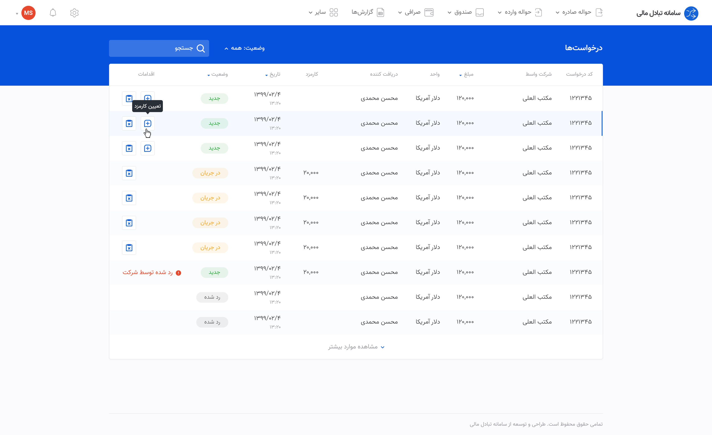
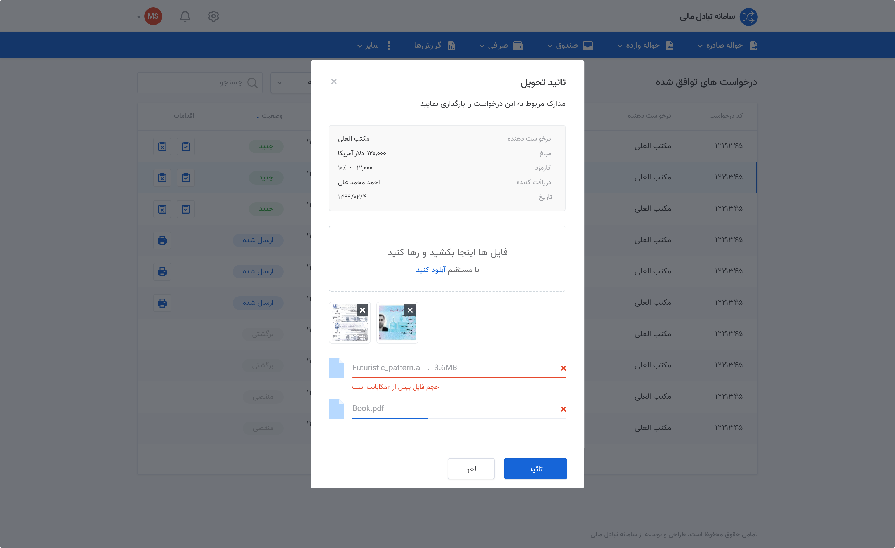
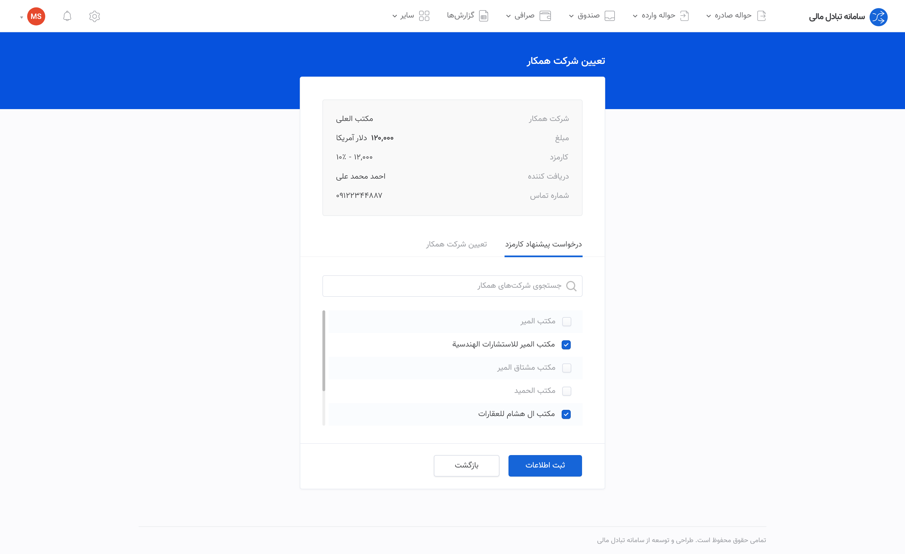
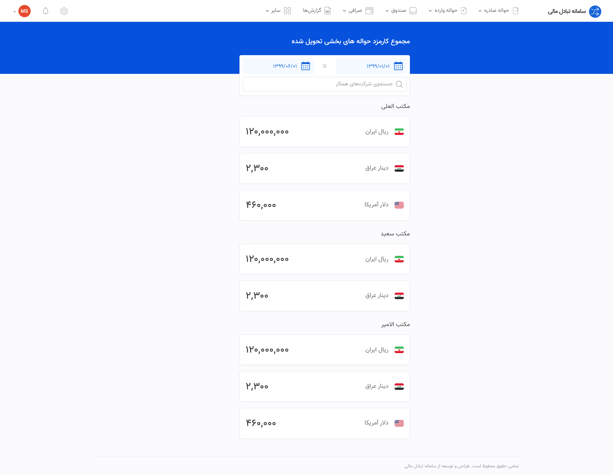

# About
This repository is Exchange Managment System Web Panel that allows customer to manage their exchange account.🎁

## Features
1. 💸 Manage Remitance
2. 📊 Financial Reports
3. 🧮 Accounting
4. ⚙️ Setting
5. 🔐 Privacy
6. 🀄️ Multi Language(English/Arabic/Farsi)

## Screenshots
1. Sign In

2. Forget Password

4. Request List

5. Distribution List

5. Distribution List Delivered

6. Set Distribution Company

7. Report

